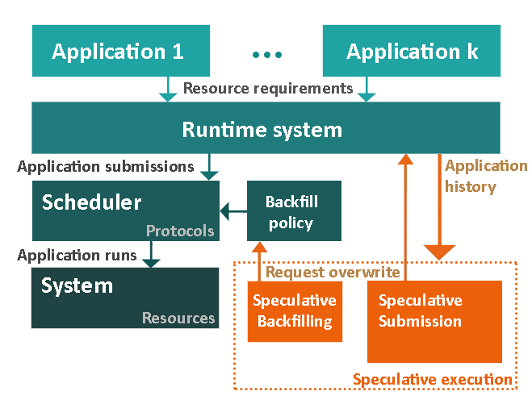

# SpeculativeScheduling
Extension of the ScheduleFlow Simulator (v1.0) to allow speculative request times at submission and during backfill. The following figure shows the main architecture of the code:

Teal modules are included in the ScheduleFlow Simulator. Orange modules are implemented in the current code.

The python objects represent an extension of the classic reservation-based HPC schedulers by using speculation to determine the resource requirements of stochastic applications based on their past behavior. Specifically, we augment the existing HPC model by speculatively overwriting the request times (including the initial one and subsequent ones in case of failures) of an application during submission.

The backfilling algorithm is also extended to include speculation by allowing stochastic jobs to be
scheduled into smaller backfilling spaces than their requests (temporary overwrite of their requirements).

More details about implementation details as well as examples can be found on the wiki.

#### Paper

If you use the resources available here in your work, please cite our paper:

*Speculative Scheduling Techniques for Stochastic HPC Applications*. Ana Gainaru, Guillaume Pallez (Aupy), Hongyang Sun, Padma Raghavan [In submission at ICPP 2019] 

## Usage

There are currently 2 scripts that can be used to trigger different scheduling scenarios:

* The `run_speculative_submission` script tests the speculative deployment of stochastic applications by using past information of jobs to overwrite their request run time
* The `run_speculative_backfill` script tests the speculative backfilling algorithm for different ratios of small to large jobs
